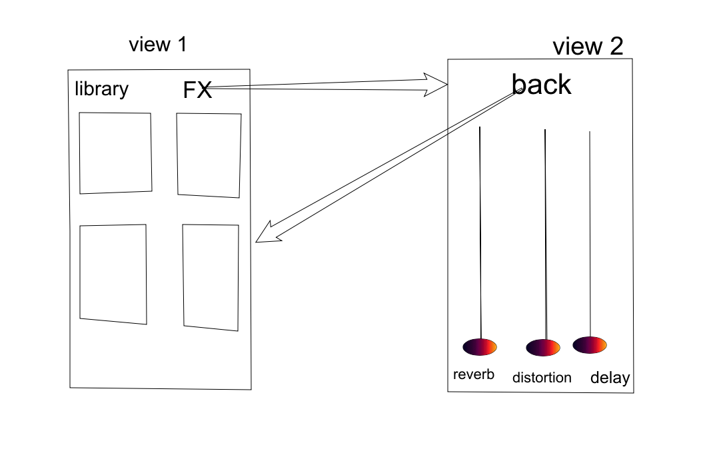

Olaf Kroon
10787321

# Design

## Classes

The app will be created using object oriented programming. Every pad on the drum machine will be represented by a class called DrumPad . The entire drum machine will be controlled using a singleton called DrumController.

### Drumpad design

The DrumPad class represents a pad on the interface. Every object can store a sample and data regarding the amount of effects used. The class has one method that plays an audiofile.

```swift

class DrumPad {
  init {

  }
  
  var reverbParameter = 0
  var distortionParameter = 0
  var delayParameter = 0
  var audiofile = path/to/audiofile

  Method playAudio (audiofile: any, reverbParemeter: Int, distortionParameter: Int, delayParameter: Int) {
    // Play the audiofile with the given amount of FX.
  }
}
```

### DrumController design

The DrumController class will create a singleton that is used to control the drumpads. It stores a DrumPad class for each pad on the interface. It also has two methods. One for replacing the hits of every pad when the users selects a new drumkit and one for changing the amount of effects used on the samples. 

``` Swift
class DrumController {

  DrumController = SharedInstance
  privit init {
  }
  
  var DrumPad = Kick
  var DrumPad = HiHat
  var DrumPad = Snare
  var DrumPad = Tom
  
  func replaceHits (drumKit: String) {
      // Replace the sound of every pad 
  }
  
  func addFx (reverbWetness : Int, distortionWetness : Int, delayWetness: Int) {
      // Manipulate the amount of fx on the output of the drum machine
  }   
}
```
## Views

 
 
### View 1
 
View one consists of 4 drum pads, a library button that activates a drop down menu and a FX button that segue's to a FX mixer. Pressing a drumpad will trigger the playaudio method from the corresponding DrumPad object. Selecting a drum kit in the drop down menu triggers the replace function in the singleton to update the samples used by the drum machine. 

### View 2

View two consist of 2 sliders that can represent a value beteen 0 and 100. These numbers represent the wetness (the amount of dry audio signal affected by the effects) of these effects. Once the user presses back the addFx method is called to update the new FX settings and then returns to view 1. 

## Frameworks

To create this app the AudioKit Library will be used. Audiokit is an extensive library used for audioprocessing in Swift.


