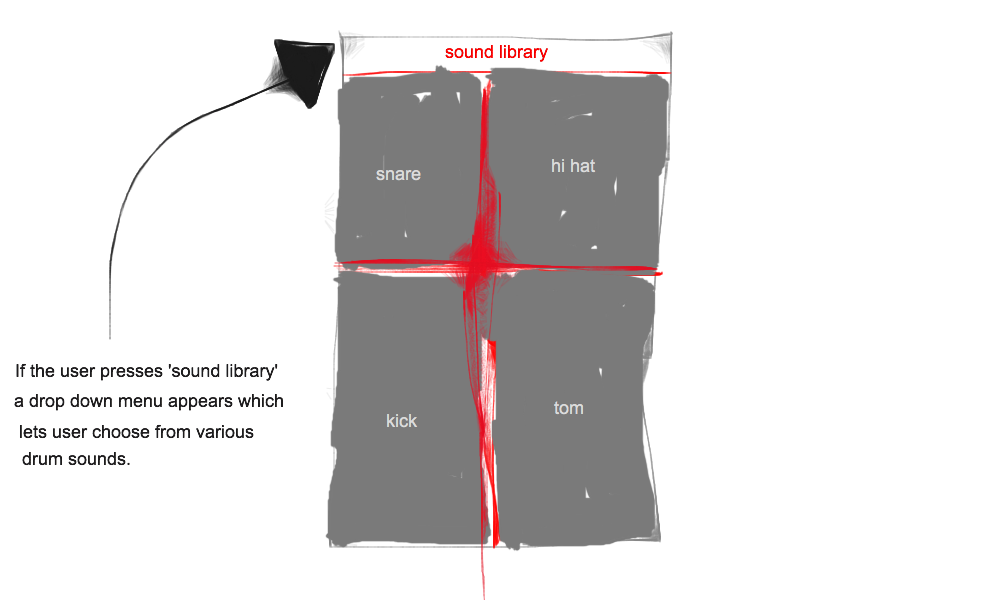

- Olaf Kroon
- 10787321
- 9.01.2017

# finalProject
A sample based digital drumpad for your iPhone. 

## Problem that will be solved by this app
Musicians like to jam all day long. However, when there's a jam going on in places without proper sound isolation a drum kit is simply way to loud. Drumpad is an application that will allow the user to use his screen as a drumkit by converting the screen of his device into a Roland SPD style drumpad. The screen will be divided into four different pads that can be pressed to trigger samples. Now musicians can lay down some drum beats with a variety of sounds without being evicted from their homes due to noise complaints. 

_the most basic app design_

## External libraries

For this project I will either use the AVAudioPlayer class in swift or an external library called audiokit. Audiokit has more potential for extending functionality of the app than AVAudioPLayer but is really synthesis focused instead of sample focused. I have to consider whether audiokit will reduce the amount of code needed to implement this project. AVAudioPlayer is really basic, which will limit the extension possibilities drastically compared to when using audiokit. 

## Decompsing the app

### View

The app will only have one view. This view consist of 4 pads (kick, hi hat, snare and tom) and a drop down menu in which users can select different drum kits. 

### Model

The only data this app needs to save are some small audio files. These will probably be saved in a dictionairy / array that will correspond with the names / index of a drop down menu.

### Controller

The view and the model will work together via the controller. Samples will be triggerd via buttons and drum kits will be selected via a drop down menu. 

## Possible problems / limitations

- Not being able to play two sounds simultaneously

This problem could arise if an audio player can only play one file at the time. The obvious solution for this problem is to use one audio player for each trigger.

- Mixing sound without code

Mixing the samples outside of Xcode (for example volume, EQ and panning) will save lots of code. However, it could create a problem when adding features that enable users to mix their sounds in app.

## Possible extensions

In the initial design of this app users can only select drumkits and play those via the pads that trigger samples. If time allows me to i'd like to implement several extentions to the app.

- Enable the user to mix samples from different kits to one drum pad
- Enable users to add sound effects such as distortion and reverb to their samples
- Enable users to mix the drum kits
- Enable users to load their own samples

## Similar apps

There are quite a few similar apps in the app store. Most of these apps are focused on emulating an ableton like sample mixing experience to the user instead of an SPD like drum pad expierence. Most of the apps in the app store have extra features such as playing along with songs and playing entire pieces of music with a single tap as well.
